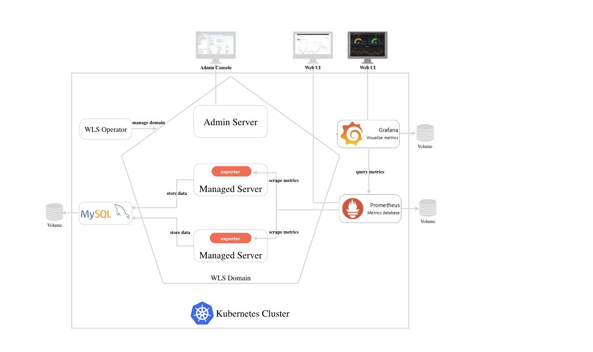

## Monitoring WebLogic Server with Grafana Dashboard
This is an end-to-end sample that walks through the steps to setup monitoring for WebLogic domains using Prometheus and Grafana from scratch. In the end you'll have Prometheus, Grafana, WLS domains installed, configured and running. And runtime metrics of WebLogic servers will be visualized in a Grafana dashboard.

Firstly, let's check [what's in the WebLogic Dashboard](docs/dashboard.md).

Before we go into the detail steps, see the diagram below for the overall architecture containing the basic components we'll deploy to Kubernetes cluster.



Here's how the WebLogic metrics come all the way from WebLogic server and eventually displayed in the dashboard:
- WebLogic servers exposes their runtime data via REST api.
- The exporter running on each WebLogic server acquires WebLogic data via calling REST api, translates to the Prometheus metrics format and exposes in a HTTP endpoint.
- Prometheus server is responsible for periodically scraping the metrics from the endpoints and store to its time series database.
- Grafana server queries the metrics from Prometheus using PromQL and display the metrics and series in a visualization dashboard.

## Prerequisites
- Have a running Kubernetes cluster version 1.10 or higher.
- Have Helm installed.  
- Clone this repository.
  ```
  git clone https://github.com/oracle/weblogic-monitoring-exporter.git
  ```
- Change the directory to the root folder of this sample. All the commands in the step-by-step guide below are supposed to run under this root folder.
  ```
  cd weblogic-monitoring-exporter/samples/kubernetes/end2end/
  ```

## Step-by-Step Guide
1. [Configuring PV Path](docs/01-pv-path.md)
1. [Setting up MYSQL Server](docs/02-mysql.md)
1. [Installing the WLS Operator](docs/03-wls-operator.md)
1. [Running a WLS Domain](docs/04-wls-domain.md)
1. [Installing Prometheus](docs/05-prometheus.md)
1. [Installing Grafana](docs/06-grafana.md)

Follow the [cleanup](docs/07-cleanup.md) guide to clean your environment.
