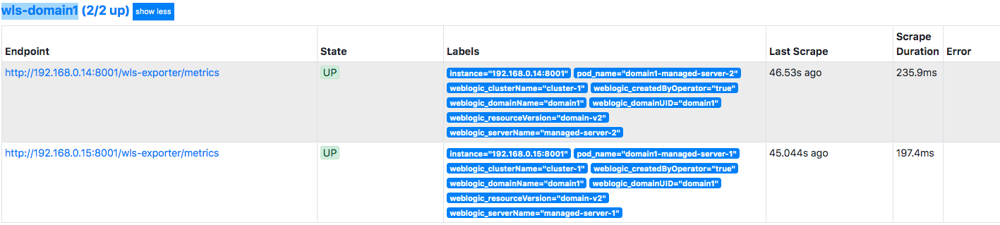

## Installing Prometheus
Install Prometheus using a [Helm chart](https://github.com/helm/charts/tree/master/stable/prometheus) with the customized [values.yaml](../prometheus/values.yaml) file.

Create a new namespace `monitoring`.
```
kubectl create ns monitoring
```
Deploy the PV and PVC YAML file.
```
kubectl apply -f prometheus/persistence.yaml
```
Install the Prometheus chart.
```
helm install --wait --name prometheus --namespace monitoring --values  prometheus/values.yaml stable/prometheus
```
In the customized values, we add a new job named `wls-domain1` to scrape data from the WLS domain created in the previous step.

### Verification
Wait until all the Prometheus pods are running and ready.
```
kubectl -n monitoring get pod -l app=prometheus
```
> output
```
NAME                                            READY   STATUS    RESTARTS   AGE
prometheus-kube-state-metrics-dbfff5557-jc5sp   1/1     Running   0          25h
prometheus-node-exporter-9t8mp                  1/1     Running   0          25h
prometheus-server-5789fffc86-qw4mw              2/2     Running   0          25h
```
Check the Prometheus sevices.
```
kubectl -n monitoring get svc -l app=prometheus
```
> output
```
NAME                            TYPE        CLUSTER-IP      EXTERNAL-IP   PORT(S)        AGE
prometheus-kube-state-metrics   ClusterIP   None            <none>        80/TCP         25h
prometheus-node-exporter        ClusterIP   None            <none>        9100/TCP       25h
prometheus-server               NodePort    10.99.199.236   <none>        80:30000/TCP   25h

```
### Access the Prometheus web UI
Now you can access the Prometheus web UI in your browser with the URL `http://<HostIP>:30000`.  
In the top menu, click `Status` and then `Targets`. The target page is displayed. Go to the bottom of the page. You'll find that the two endpoints of `wls-domain1` are up and healthy.



Next: [Installing Grafana](06-grafana.md)
