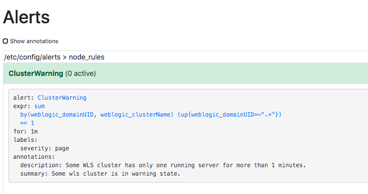
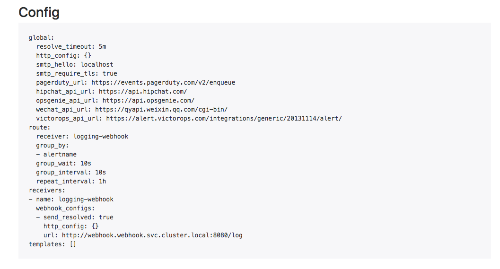
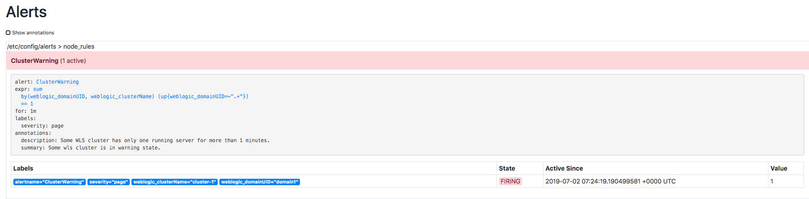

## Firing Alerts
This step shows you how to trigger alerts.

### Configuring Alerts
When installing the Prometheus chart, we configure all the alerting-related settings in the customized [values.yaml](../prometheus/values.yaml) file.  

First, we configure the alerting rules. For demonstration purposes, we define one [alerting rule](../prometheus/values.yaml#L45) named `ClusterWarning` that will fire alerts if any WebLogic cluster has only one running server.

Second, we configure the Alertmanager. In [alertmanager.yml](../prometheus/values.yaml#L27), we define one route and one receiver that will send all the received alerts to a webhook.

### Verifying the Configuration
Access the Prometheus alerts page in your browser with the URL, `http://<HostIP>:30000/alerts`. Examine the configured alert rules and you'll see one, as shown below.  

  

Open the Alertmanager web UI at the URL, `http://<HostIP>:32000`.
- Check the configured rule and receiver at the URL, `http://<HostIP>:32000/#/status`. You'll see an Alertmanager configuration, as follows.  

  
- Check the alert page at `http://<HostIP>:32000/#/alerts`. There is no received alert yet.

### Triggering Alerts
To trigger an alert, one WebLogic cluster must have only one Managed Server running.
- Update the file `demo-domains/domain1.yaml` to change the line from `replicas: 2` to `replicas: 1`.
- Apply the updated domain resource file.
  ```
  kubectl apply -f demo-domains/domain1.yaml
  ```
If the new domain resource is applied successfully, one WebLogic Server will begin terminating. Wait until only one Managed Server is running.
```
kubectl get pod -l weblogic.domainName=domain1
```
> output
```
NAME                       READY   STATUS    RESTARTS   AGE
domain1-admin-server       1/1     Running   1         2h
domain1-managed-server-1   1/1     Running   1         2h
```

Keep refreshing the Prometheus alerts page, `http://<HostIP>:30000/alerts`. An alert will be generated. At first, the state of the alert is PENDING and after about one minute (or after the configured number of minutes), the state of the alert changes to FIRING. It is at this time that the alert is sent to the Alertmanager.



### Verification in Alertmanager
Now let's check whether the Alertmanager has received the alert. View the Alertmanager's alert page at `http://<HostIP>:32000/#/alerts`. You should find one alert, as shown below.


### Verification in Webhook Server
After the Alertmanger receives the alert, it should send notifications to the configured receiver, the webhook. Check the output of the webhook server.  

Get the pod name of the webhook server.
```
POD_NAME=$(kubectl -n webhook get pod -l app=webhook -o jsonpath="{.items[0].metadata.name}")
```
Check the output of the webhook server.
```
kubectl -n webhook logs -f $POD_NAME
```
> output
```
Webhook is serving at port 8080
192.168.0.127 - - [02/Jul/2019 07:25:29] "POST /log HTTP/1.1" 200 -
!!! Receiving an alert.
{
  "status": "firing",
  "labels": {
    "alertname": "ClusterWarning",
    "severity": "page",
    "weblogic_clusterName": "cluster-1",
    "weblogic_domainUID": "domain1"
  },
  "annotations": {
    "description": "Some WLS cluster has only one running server for more than 1 minutes.",
    "summary": "Some wls cluster is in warning state."
  },
  "startsAt": "2019-07-02T07:25:19.190499581Z",
  "endsAt": "0001-01-01T00:00:00Z",
  "generatorURL": "http://prometheus-server-547f5d857c-m4d8t:9090/graph?g0.expr=sum+by%28weblogic_domainUID%2C+weblogic_clusterName%29+%28up%7Bweblogic_domainUID%3D~%22.%2B%22%7D%29+%3D%3D+1&g0.tab=1"
}
```
One notification was received and logged by the webhook server.

Next: [Cleanup](cleanup.md)
