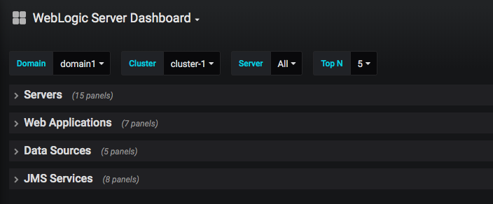
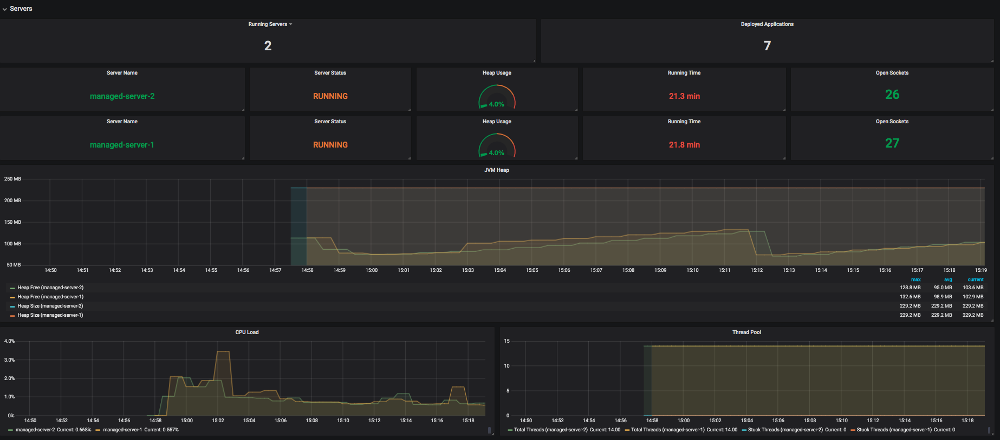
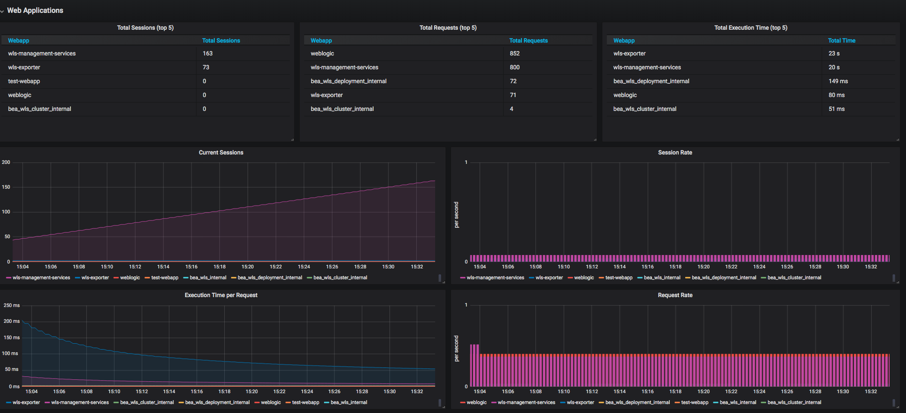
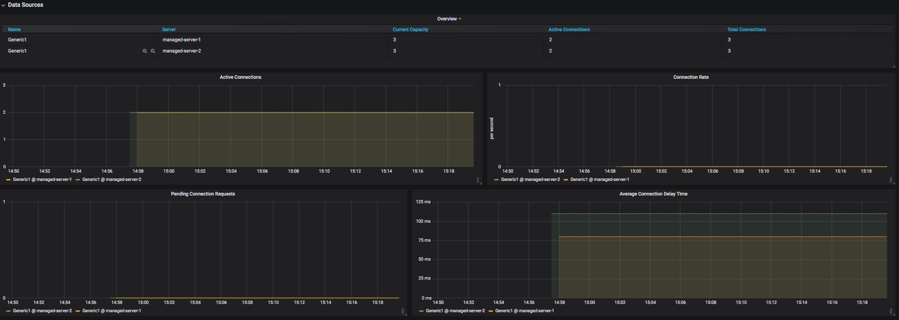
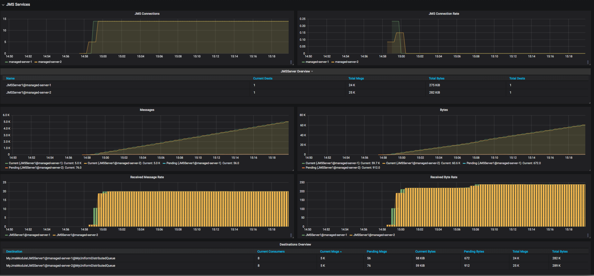

## What's in the Weblogic Dashboard
### Overview
The WebLogic Server Grafana dashboard provide a visualization of WebLogic runtime metrics allowing you to monitor and diagnose runtime deployment of WebLogic.

On top left hand corner of the Weblogic Server dashboard page, there are some filters which allows you to filter out metrics based on different domains, different clusters, and different servers. Another filter is the `Top N` whose candidates values are 3, 5, 7 and 10. The value will be applied to some panels to only show the top N elements to avoid too many elements displayed.  

The WebLogic dashboard has four rows: `Servers`, `Web Applications`, `Data Sources` and `JMS Services`, each row can be folded and unfolded separately.  

### Servers

### Web Applications

### Data Sources

### JMS Services

