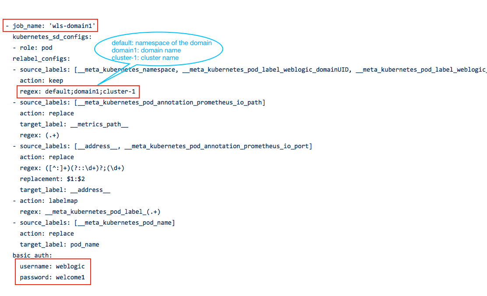

## Monitoring an Existing WebLogic Domain
In this step, we show you how to integrate Prometheus and Grafana with an existing WebLogic domain.

Assume you have already followed [Manage Domains](https://oracle.github.io/weblogic-kubernetes-operator/userguide/managing-domains/) guide in the WebLogic Kubernetes Operator to run a WebLogic domain and have followed previous steps in this sample to setup Prometheus and Grafana.

### Installing the wls-exporter to the WebLogic domain
You need to install the wls-exporter web application to the WebLogic domain.

First, generate the wls-exporter war file following the [building from source](https://github.com/oracle/weblogic-monitoring-exporter#building-from-source) guide using the configuration file in this sample [exporter-config.yaml](../dashboard/exporter-config.yaml). Then deploy the war to the WebLogic servers and clusters using WLST or WDT.  

After the wls-exporter is installed successfully, you can check the exported WebLogic Runtime Metrics from each server, see the detail guide [here](04-wls-domain.md#check-the-weblogic-runtime-metrics).

### Updating Prometheus Configuration
Next we need to inform Prometheus server to scrape metric from the WebLogic domain. Basically we need to add a new job to prometheus.yml, the configuration file of Prometheus server. The job is similar to what we added for `domain1` in [values.yaml](../prometheus/values.yaml#L59) of Prometheus chart. As shown below, lines in red need to be updated properly.



Since the Prometheus server is already running, can we update its configuration dynamically without restart? The answer is yes. When installing with the Prometheus chart, there are two containers running in Prometheus server pod: one is for Prometheus server, the other is to detect any change in the ConfigMap and apply the latest configuration to runtime. So what we need to do is to update the ConfigMap of Prometheus server to add a new job to prometheus.yml file. 

You can edit the ConfigMap directly via `kubectl edit`.
```
kubectl -n monitoring edit cm prometheus-server
```
Or you can save, update and re-apply the ConfigMap.
1. Save the current ConfigMap to a temporary file `cm.yaml`.  
   `kubectl -n monitoring get cm prometheus-server -oyaml > cm.yaml`
1. Update the file `cm.yaml` accordingly.  
   `vi cm.yaml`
1. Apply the new ConfigMap.  
   `kubectl -n monitoring apply -f cm.yaml`

Now wait until the new configuration applied to runtime. You can access the Prometheus web UI to verify new targets are added and new metrics are scraped by Prometheus server. Follow the guide [here](05-prometheus.md#access-the-prometheus-web-ui).

### Integrating with Grafana and Dashboard
Nothing needs to be updated to Grafana configuration or the WebLogic dashboard. After the Prometheus server start to scrape and store metrics of the new WebLogic domain, the metrics will be displayed in the WebLogic dashboard seamlessly. When you access the WebLogic dashboard in Grafana web UI, the new domain name will be displayed in the drop-down list of the `domain` filter.

